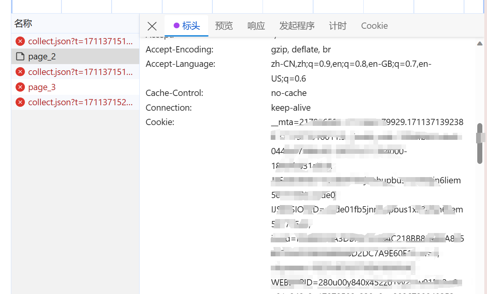

# 开始开发

## 配置清华源

注意：请在管理员环境下运行下面的操作

```
python3 -m pip3 config set global.index-url https://pypi.tuna.tsinghua.edu.cn/simple --user
```

官网的介绍：https://mirrors.tuna.tsinghua.edu.cn/help/pypi/

## 安装依赖

安装依赖

```shell
pip3 install pandas playwright
```

安装需要的浏览器

```shell
playwright install
```

## 运行

适用Vscode的话，直接在xiecheng.py文件中按F5运行即可

## 命令行运行

```shell
python3 xiecheng.py
```

# 爬取美团点评的数据

## 获取cookie

1. 打开浏览器，登录美团点评
2. 打开开发者工具，找到cookie



需要对复制的cookie进行处理，转成json

可以用这个网站：https://uutool.cn/cookie2json/

3. 复制cookie到代码中
4. 运行代码